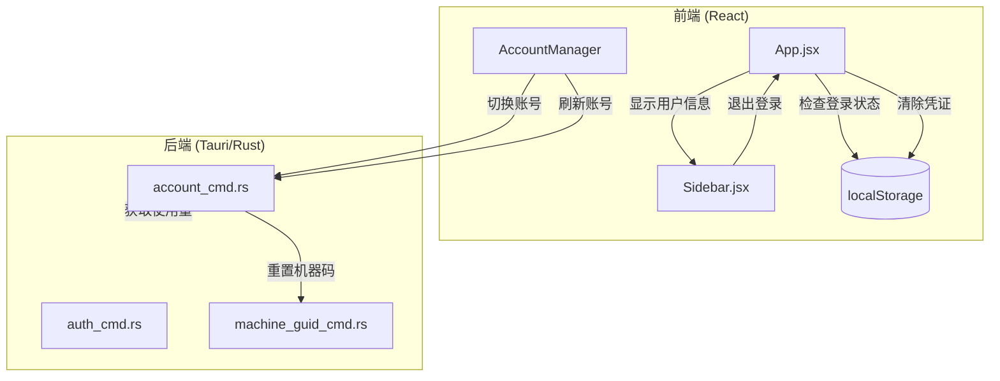

# Design Document: User Session Persistence

## Overview

本设计文档描述了桌面端应用的用户会话持久化、用户信息显示、Kiro 账号切换时机器码重置以及刷新账号时同步刷新使用量的实现方案。

主要功能：
1. 用户登录后关闭应用再次打开时自动恢复登录状态
2. 侧边栏显示用户邮箱和退出按钮
3. 切换 Kiro 账号时自动重置机器码
4. 刷新所有账号时同时刷新 token 和使用量数据

## Architecture



## Components and Interfaces

### 1. 会话持久化组件

**现有实现分析：**
- `App.jsx` 已经在 `useEffect` 中检查 `localStorage` 的 `auth_token` 和 `user`
- 登录成功后通过 `handleUserAuth` 保存到 `localStorage`
- 退出登录通过 `handleUserLogout` 清除 `localStorage`

**需要修改：**
- 当前实现已经基本满足需求，只需确保逻辑完整

### 2. 用户信息显示组件

**修改 Sidebar.jsx：**

```jsx
// 新增 props
interface SidebarProps {
  user: User | null;           // 当前登录用户
  onLogout: () => void;        // 退出登录回调
  // ... 其他现有 props
}

// 用户信息区域组件
function UserInfoSection({ user, onLogout, colors }) {
  if (!user) return null;
  
  return (
    <div className={`mx-3 mb-3 ${colors.sidebarCard} rounded-xl p-3`}>
      <div className="flex items-center gap-2">
        <div className="w-8 h-8 rounded-lg bg-blue-500/20 flex items-center justify-center">
          <User size={14} className="text-blue-300" />
        </div>
        <div className="flex-1 min-w-0">
          <div className="text-xs font-medium truncate" title={user.email}>
            {user.email}
          </div>
        </div>
      </div>
      <button
        onClick={onLogout}
        className="mt-2 w-full text-xs text-red-400 hover:text-red-300 
                   flex items-center justify-center gap-1 py-1.5 
                   rounded-lg hover:bg-red-500/10 transition-colors"
      >
        <LogOut size={12} />
        退出登录
      </button>
    </div>
  );
}
```

### 3. 机器码重置组件

**修改 AccountManager/index.jsx 的 confirmSwitch 函数：**

```javascript
const confirmSwitch = useCallback(async () => {
  // ... 现有逻辑
  
  // 在切换账号时始终重置机器码（不依赖设置）
  try {
    await invoke('reset_system_machine_guid');
    console.log('[MachineId] Machine ID reset on account switch');
  } catch (e) {
    console.error('[MachineId] Failed to reset machine ID:', e);
    // 继续执行，不阻塞切换流程
  }
  
  // ... 继续切换账号逻辑
}, []);
```

### 4. 刷新账号时同步刷新使用量

**修改 useAccounts.js 的 autoRefreshAll 函数：**

```javascript
const autoRefreshAll = useCallback(async (accountList, forceAll = false) => {
  // ... 现有逻辑
  
  for (let i = 0; i < accountsToRefresh.length; i++) {
    const account = accountsToRefresh[i];
    try {
      // 使用 sync_account 替代 refresh_account_token
      // sync_account 会同时刷新 token 和 usage 数据
      const updated = await invoke('sync_account', { id: account.id });
      // ... 更新账号
    } catch (e) {
      // ... 错误处理
    }
  }
}, []);
```

## Data Models

### User 数据模型（前端）

```typescript
interface User {
  id: string;
  email: string;
  name: string;
  avatar?: string;
  provider: string;
}
```

### LocalStorage 存储结构

```typescript
// auth_token: string - JWT 认证令牌
// user: string - JSON 序列化的 User 对象
```

### Account 数据模型（后端）

```rust
pub struct Account {
    pub id: String,
    pub email: String,
    pub usage_data: Option<serde_json::Value>,  // 使用量数据
    // ... 其他字段
}
```

## Correctness Properties

*A property is a characteristic or behavior that should hold true across all valid executions of a system—essentially, a formal statement about what the system should do. Properties serve as the bridge between human-readable specifications and machine-verifiable correctness guarantees.*

### Property 1: Session Restoration Based on Token Validity

*For any* stored authentication credentials, if the token is valid, the user's logged-in state SHALL be restored; if the token is invalid or expired, the credentials SHALL be cleared and the login page SHALL be shown.

**Validates: Requirements 1.2, 1.3**

### Property 2: Machine ID Generation on Account Switch

*For any* Kiro account switch operation, a new machine ID SHALL be generated in valid UUID format, and the switch process SHALL complete regardless of machine ID reset success or failure.

**Validates: Requirements 3.1, 3.2, 3.3**

### Property 3: Refresh Updates Both Token and Usage Data

*For any* account refresh operation triggered by "refresh all", both the token AND usage data SHALL be updated for each account (unless the API call fails, in which case only the error is logged).

**Validates: Requirements 4.1, 4.3, 4.4**

## Error Handling

### 会话恢复错误处理

1. **Token 无效或过期**：清除 localStorage，显示登录页面
2. **localStorage 读取失败**：显示登录页面
3. **用户数据解析失败**：清除 localStorage，显示登录页面

### 机器码重置错误处理

1. **重置失败**：记录错误日志，继续执行账号切换
2. **权限不足**：记录错误日志，继续执行账号切换

### 刷新账号错误处理

1. **Token 刷新失败**：记录错误，标记账号状态为失败
2. **Usage API 调用失败**：记录错误，保留旧的 usage 数据
3. **网络错误**：记录错误，继续处理下一个账号

## Testing Strategy

### 单元测试

1. **会话持久化测试**
   - 测试 localStorage 存储和读取
   - 测试登录状态恢复逻辑
   - 测试退出登录清除逻辑

2. **用户信息显示测试**
   - 测试 Sidebar 组件渲染用户信息
   - 测试邮箱截断显示
   - 测试退出按钮点击事件

3. **机器码重置测试**
   - 测试 UUID 格式验证
   - 测试重置函数调用

4. **刷新账号测试**
   - 测试 sync_account 调用
   - 测试 usage_data 更新

### 属性测试

使用 fast-check (JavaScript) 进行属性测试：

1. **Property 1**: 测试会话恢复逻辑对各种 token 状态的处理
2. **Property 2**: 测试机器码生成的 UUID 格式有效性
3. **Property 3**: 测试刷新操作对 token 和 usage 数据的更新

### 测试配置

- 每个属性测试运行至少 100 次迭代
- 使用 Vitest 作为测试框架
- 使用 fast-check 进行属性测试
